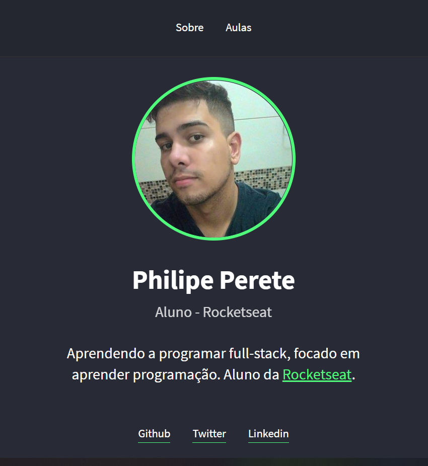
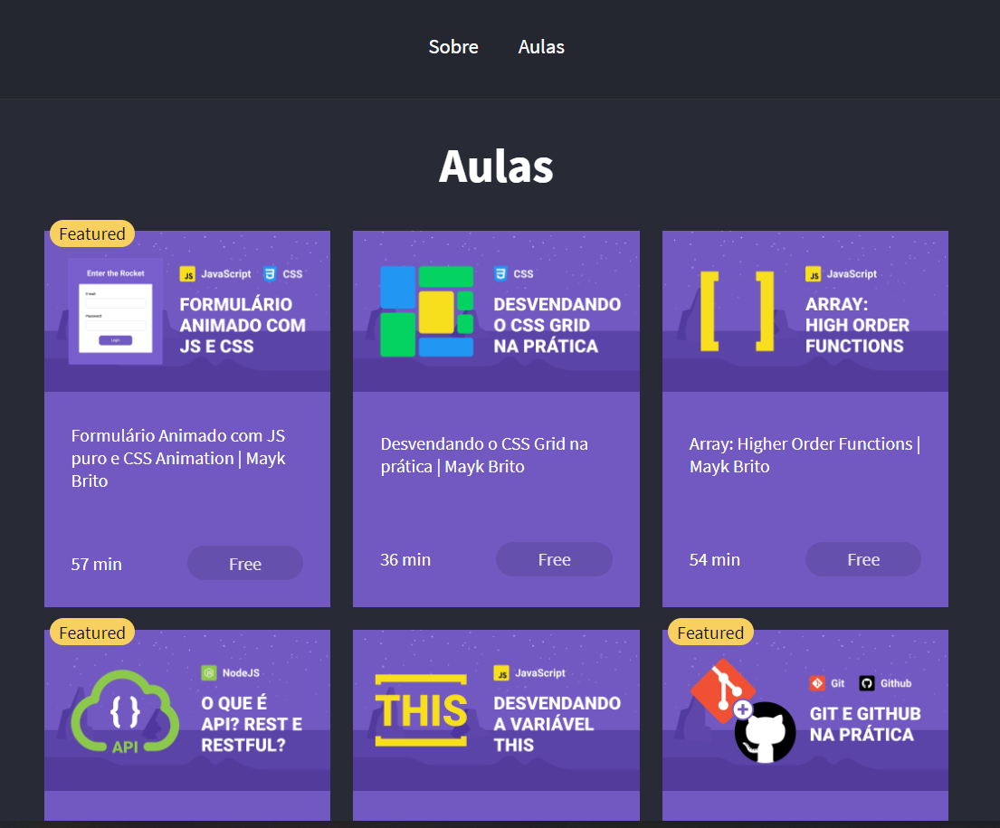
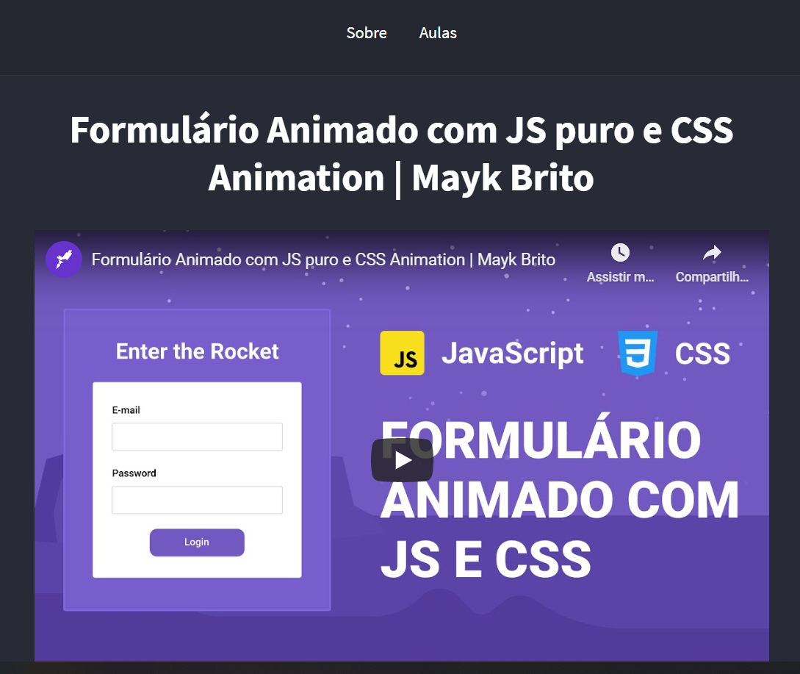

<h1 align="center">
    
</h1>

<p align="center">
  

  

  <a href="https://github.com/philipeperete/MeuSiteLaunchbase/commits/master">
    
  </a>

  

</p>

<h1 align="center"> Meu Site - Launchbase </h1>

_________

## 💻 Sobre o projeto

Criação de um site com informações pessoais e aulas do Mayk Brito 📚. 

Projeto foi desenvolvido durante a **Launchbase** da [Rocketseat][rs] 🚀.

_________

## 🎨 Layout

<p align="center" style="display: flex; align-items: flex-start; justify-content: center;">
  
 
  <br>
  
  
</p>

_________

## 🛠 Tecnologias

As seguintes ferramentas foram usadas na construção do projeto:

 - [HTML5]
 - [CSS3]
 
 - [JavaScript]
 
 - [NodeJS]
 - [npm]
 - [ExpressJS]
 - [Nodemon]
 - [Nunjucks]

- Programado no [Visual Studio Code]

_________

## 🚀 Como executar o projeto

```bash
# Clone este repositório.
$ git clone https://github.com/philipeperete/MeuSiteLaunchbase

# Acesse a pasta onde está o arquivo "server.js" do projeto no terminal/cmd.
$ node server.js

# Abre o navegador e acesse: 
$ http://localhost:5000/

```

_________

## 📝 Licença

O projeto se encontra sob licença MIT.

Para mais detalhes, acesse [license](LICENSE).

_________

Agradecimentos [Rocketseat][rs] 🚀.

* Twitter: [Philipe Perete](https://twitter.com/PhilipePerete).
* Linkedin: [Philipe Perete](https://www.linkedin.com/in/philipe-perete-b76622104/).
* Github: [Philipe Perete](https://github.com/philipeperete).

Feito com 💙 por **Philipe Perete** 👻.


[HTML5]: https://developer.mozilla.org/en-US/docs/Web/Guide/HTML/HTML5
[CSS3]: https://developer.mozilla.org/en-US/docs/Archive/CSS3 
 
[JavaScript]: https://www.javascript.com/  

[ExpressJS]: https://expressjs.com/
[Nunjucks]: https://mozilla.github.io/nunjucks/templating.html
[Nodemon]: https://nodemon.io/
[NodeJS]: https://nodejs.org/
[npm]: https://www.npmjs.com/get-npm

[Visual Studio Code]: https://code.visualstudio.com/ 
[rs]: https://rocketseat.com.br 
